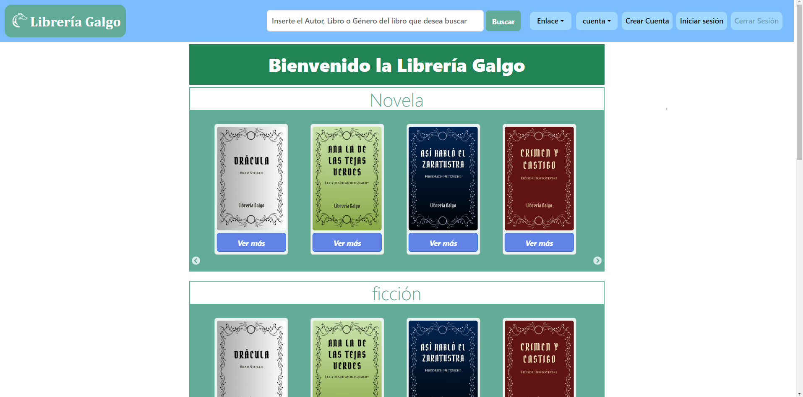
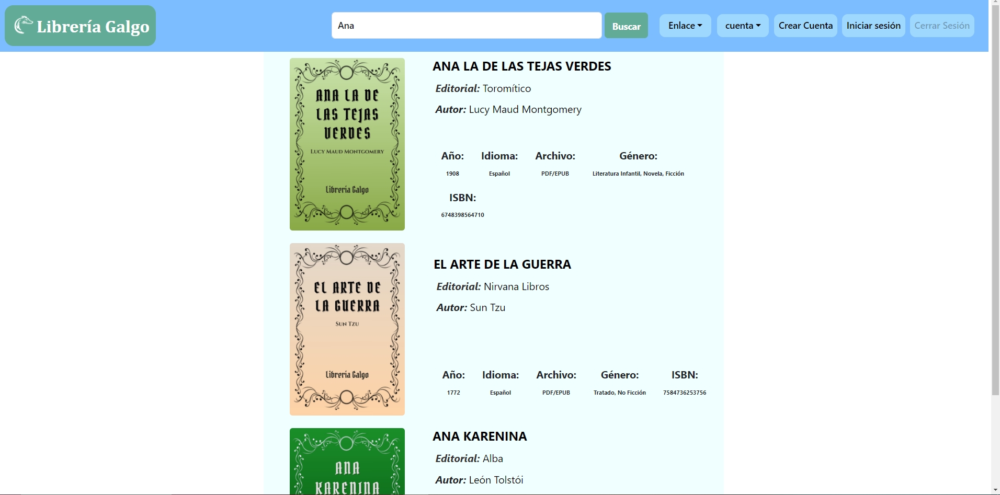
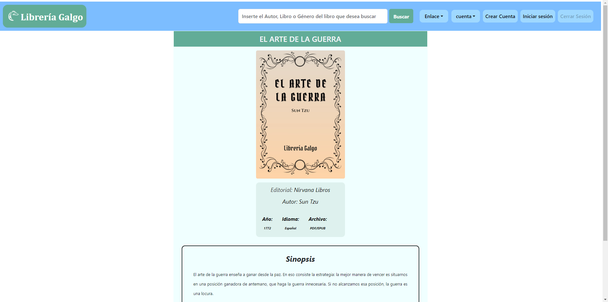
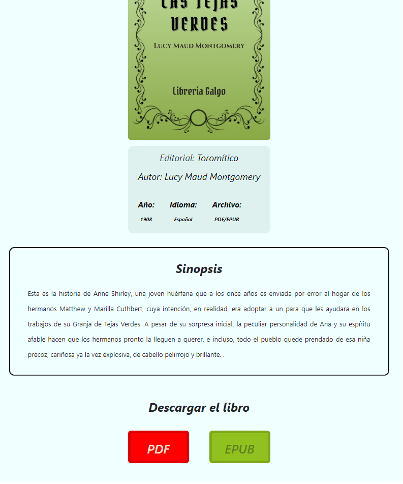
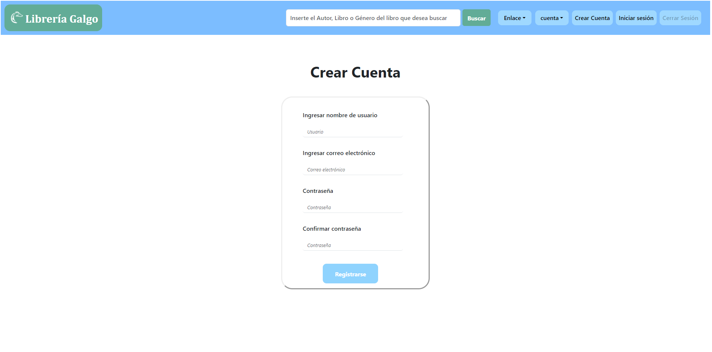
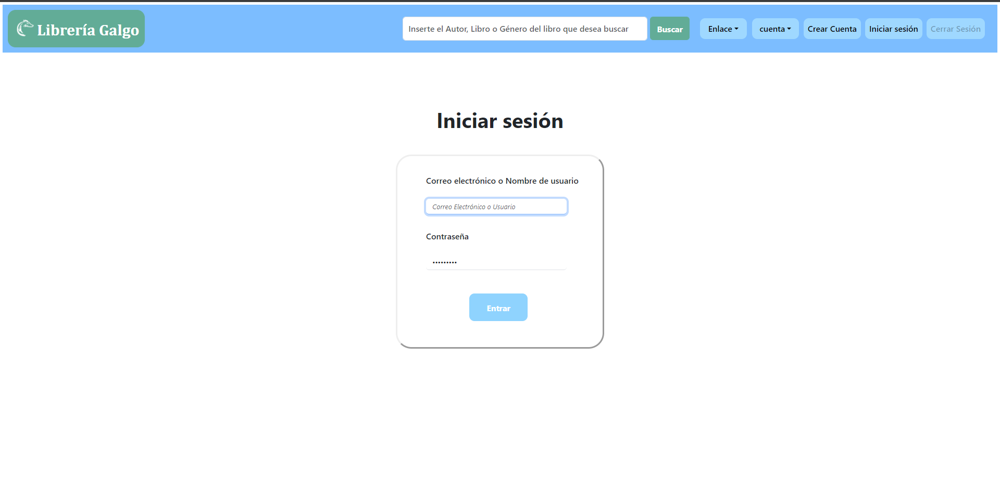

# Librería Galgo
Página web para una biblioteca digital, hecho con node.js y librerías como React y react bootstrap.
Este proyecto fue realizado en conjunto con [AnaCrisGM](hhtps//github.com/AnaCrisGM), utilizamos mongodb 
para la base de datos y Cloudinary para las ligas de las imagenes.

Como datos adicionales, es necesario correr el comando de conexión para poder conectarse con la base de datos
node mongo.js desde una terminal y desde otra terminal inicializar node.js con npm start.

Librería Galgo es una biblioteca digital diseñada para proporcionar acceso libre a una amplia variedad de libros. Desarrollada con React, esta aplicación intuitiva y responsiva permite a los usuarios explorar y descubrir literatura de manera sencilla y eficiente.

# Características Principales
- Página Inicial: Una interfaz amigable donde los libros están organizados por categorías, facilitando la navegación y el descubrimiento de nuevas lecturas.

- Búsqueda y Filtrado: Una funcionalidad avanzada para mostrar y clasificar resultados de búsqueda, permitiendo a los usuarios encontrar rápidamente los libros que desean.

- Detalles del Libro: Cada libro tiene su propia página dedicada que presenta una descripción detallada, junto con enlaces de descarga y acceso directo a los libros.

- Autenticación de Usuarios: Incluye páginas de Login y Signup para que los usuarios puedan crear cuentas y gestionar sus preferencias de lectura.

# Vistas de la página
***Página principal***

***Página de resultados de busqueda***

***Página del libro***

***Links para descarga o lectura del libro***

***Página para crear una cuenta***

***Página para inciar sesión***

 
## Available Scripts

In the project directory, you can run:

### `npm start`

Runs the app in the development mode.\
Open [http://localhost:3000](http://localhost:3000) to view it in your browser.

The page will reload when you make changes.\
You may also see any lint errors in the console.

### `npm test`

Launches the test runner in the interactive watch mode.\
See the section about [running tests](https://facebook.github.io/create-react-app/docs/running-tests) for more information.

### `npm run build`

Builds the app for production to the `build` folder.\
It correctly bundles React in production mode and optimizes the build for the best performance.

The build is minified and the filenames include the hashes.\
Your app is ready to be deployed!

See the section about [deployment](https://facebook.github.io/create-react-app/docs/deployment) for more information.

### `npm run eject`

**Note: this is a one-way operation. Once you `eject`, you can't go back!**

If you aren't satisfied with the build tool and configuration choices, you can `eject` at any time. This command will remove the single build dependency from your project.

Instead, it will copy all the configuration files and the transitive dependencies (webpack, Babel, ESLint, etc) right into your project so you have full control over them. All of the commands except `eject` will still work, but they will point to the copied scripts so you can tweak them. At this point you're on your own.

You don't have to ever use `eject`. The curated feature set is suitable for small and middle deployments, and you shouldn't feel obligated to use this feature. However we understand that this tool wouldn't be useful if you couldn't customize it when you are ready for it.

## Learn More

You can learn more in the [Create React App documentation](https://facebook.github.io/create-react-app/docs/getting-started).

To learn React, check out the [React documentation](https://reactjs.org/).

### Code Splitting

This section has moved here: [https://facebook.github.io/create-react-app/docs/code-splitting](https://facebook.github.io/create-react-app/docs/code-splitting)

### Analyzing the Bundle Size

This section has moved here: [https://facebook.github.io/create-react-app/docs/analyzing-the-bundle-size](https://facebook.github.io/create-react-app/docs/analyzing-the-bundle-size)

### Making a Progressive Web App

This section has moved here: [https://facebook.github.io/create-react-app/docs/making-a-progressive-web-app](https://facebook.github.io/create-react-app/docs/making-a-progressive-web-app)

### Advanced Configuration

This section has moved here: [https://facebook.github.io/create-react-app/docs/advanced-configuration](https://facebook.github.io/create-react-app/docs/advanced-configuration)

### Deployment

This section has moved here: [https://facebook.github.io/create-react-app/docs/deployment](https://facebook.github.io/create-react-app/docs/deployment)

### `npm run build` fails to minify

This section has moved here: [https://facebook.github.io/create-react-app/docs/troubleshooting#npm-run-build-fails-to-minify](https://facebook.github.io/create-react-app/docs/troubleshooting#npm-run-build-fails-to-minify)
